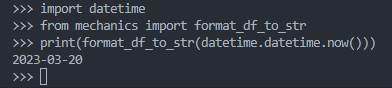

---
title: Convert datetime object to string
layout: base
excerpt_separator: <!--more-->
categories: 
- Date Manipulation
--- 
### format_df_to_str
&emsp; It takes an input as a datetime object and converts it into a datetime string in ''%Y-%m-%d’' format.
<!--more-->
##### Code
```python
def format_df_to_str(d):
    if d == None: return datetime.datetime.now().strftime('%Y-%m-%d')
    else: return d.strftime('%Y-%m-%d')
```
###### Example
