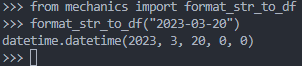

### format_str_to_df
&emsp; It takes an input as a datetime string in "%Y-%m-%d" format and converts it into a datetime object.
<!--more-->
##### Code
```python
def format_str_to_df(s):
    if s == None: return datetime.datetime.now()
    elif s == '': return ''
    else: return datetime.datetime.strptime(s, '%Y-%m-%d')
```
##### Example
