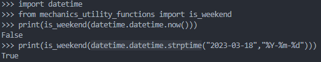

### is_weekend
&emsp; This function takes input datetime in iso format and returns whether the given date is weekend or not
<!--more-->
###### Code
```python
def is_weekend(date_time_in_isoformat_or_dto):
    if not type(date_time_in_isoformat_or_dto) == datetime.datetime:
        date_time_in_isoformat = date_time_in_isoformat_or_dto
        if 'T' in date_time_in_isoformat:
            date_in_isoformat = date_time_in_isoformat.split('T')[0]

        if '-' in date_in_isoformat: str_format = '%Y-%m-%d'
        else: str_format = '%Y%m%d'

        dto = datetime.datetime.strptime(date_in_isoformat, str_format)
    else:
        dto = date_time_in_isoformat_or_dto
    weekday_index = dto.weekday()
    if weekday_index in [5, 6]: returrn True
    else: return False
```
###### Example
