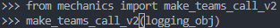
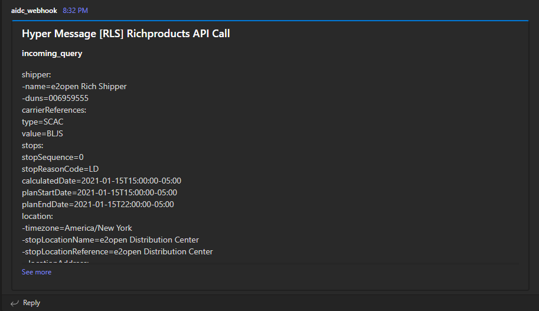

### make_teams_call_v2
&emsp; This function will send messages to the Microsoft Teams.
<!--more-->
##### Code
```python
def make_teams_call_v2(logging_obj):
    url = logging_obj['url']
    sections = []

    for i in ['incoming_query', 'local_variables', 'bnb_request', 'bnb_response', 'pricing_system_request', 'pricing_system_response', 'pa_request', 'pa_response', 'api_response', 'notes', 'errors']:
        #logging.info(i)
        if i in logging_obj['data']:
            clean_val = ujson.loads(ujson_dumps(logging_obj['data'][i]))
            logging.info(clean_val)
            sections.append({
                'startGroup':True,
                'activityTitle': i,
                #'text': ujson_dumps(logging_obj['data'][i], pretty_print=True)
                'text': deep_value_sort(clean_val)
            })

    d = {
        "@type":"MessageCard",
        "@context": "https:\/\/schema.org\/extensions",
        "title":f"Hyper Message {logging_obj['title']}",
        "summary":"this will not show up",
        "themeColor":"0078D7",
        "sections": sections
    }

    logging.info(d)
    x = requests.post(url, data=ujson.dumps(d), headers={'Content-type':'application/JSON'})
    logging.info(x.status_code)
    logging.info(x.text)
```
##### Example
```json
{
    "@type": "MessageCard",
    "@context": "https:\\/\\/schema.org\\/extensions",
    "title": "Hyper Message [RLS] Richproducts API Call",
    "summary": "this will not show up",
    "themeColor": "0078D7",
    "sections": [
        {
            "startGroup": true,
            "activityTitle": "incoming_query",
            "text": "shipper:-name=e2open Rich Shipper-duns=006959555carrierReferences:type=SCACvalue=BLJSstops:stopSequence=0stopReasonCode=LDcalculatedDate=2021-01-15T15:00:00-05:00planStartDate=2021-01-15T15:00:00-05:00planEndDate=2021-01-15T22:00:00-05:00location:-timezone=America/New York-stopLocationName=e2open Distribution Center-stopLocationReference=e2open Distribution Center--locationAddress:--address1=2627 Walker Ave NW--city=Grand Rapids--state=MI--postalCode=49544--country=US-latitude=43.0113968-longitude=-85.7255519stopSequence=1stopReasonCode=ULcalculatedDate=2021-01-16T11:00:00-05:00planStartDate=2021-01-16T11:00:00-05:00planEndDate=2021-01-17T12:00:00-05:00appointmentStartDate=2021-01-16T11:00:00-05:00appointmentEndDate=2021-01-16T12:00:00-05:00location:-timezone=America/New York-stopLocationName=e2open Store-stopLocationReference=e2open Store--locationAddress:--address1=746 E 16th St--city=Holland--state=MI--postalCode=49423--country=US-latitude=43.0113968-longitude=-85.7255519totalWeight:-value=0-unitOfMeasure=lbtotalDistance:-value=28.8-unitOfMeasure=mitransportationMode=TLequipment:-type=ReeferserviceLevel:-description=TL Standard-code=TLroundTrip=Falsehazmat=False"        },
        { "startGroup": true, "activityTitle": "local_variables", "text": "" },
        {
            "startGroup": true,
            "activityTitle": "bnb_request",
            "text": "shipper_name=e2open Rich Shipperequipment_type_text=Reeferdistance=28.8stops=2weight=0lane_count=0origin_facility=e2open Distribution Centerorigin_city=Grand Rapidsorigin_state=MIorigin_country=USorigin_postal_code=49544pickup_date_time=2021-01-15T22:00:00-05:00destination_facility=e2open Storedestination_city=Hollanddestination_state=MIdestination_country=USdestination_postal_code=49423delivery_date_time=2021-01-16T11:00:00-05:00is_bot=falsesame_day_pickup_flag=Nnext_day_pickup_flag=Npickup_day_index=-1calculated_transit_days=-1holiday_pickup_lookup_key=NA"        },
        {
            "startGroup": true,
            "activityTitle": "bnb_response",
            "text": "shipper_name=e2open Rich Shipperequipment_type_text=Reeferdistance=28.8stops=2weight=0lane_count=0origin_facility=e2open Distribution Centerorigin_city=Grand Rapidsorigin_state=MIorigin_country=USorigin_postal_code=49544pickup_date_time=2021-01-15T22:00:00-05:00destination_facility=e2open Storedestination_city=Hollanddestination_state=MIdestination_country=USdestination_postal_code=49423delivery_date_time=2021-01-16T11:00:00-05:00is_bot=falsesame_day_pickup_flag=Nnext_day_pickup_flag=Npickup_day_index=-1calculated_transit_days=-1holiday_pickup_lookup_key=NAacculumated_instructions=Nonebid_failure_reason=NAmake_bid=trueerror_msg_key=NAmultistop_flag=Nteam_flag=Nequipment_code=REEFERworking_hours=10avg_solo_miles=600avg_min_miles=1calculated_transit_time_in_hours=None"        },
        {
            "startGroup": true,
            "activityTitle": "pricing_system_request",
            "text": "origin:-city=Grand Rapids-stateOrProvince=MI-country=USA-postalCode=49544destination:-city=Holland-stateOrProvince=MI-country=USA-postalCode=49423equipment=REEFERincludeMyRate=FalserateType=SPOT"        },
        {
            "startGroup": true,
            "activityTitle": "pricing_system_response",
            "text": "status=okresponse:-transaction=a8930553-2c2a-4e86-b6f3-edb74b4f8a5d-created=2023-01-11T00:22:53.861Z--rateResponses:response:--rate:--mileage=148--reports=47--companies=5--standardDeviation=129.99----perTrip:---rateUsd=495.84---highUsd=607.79---lowUsd=399.45--averageFuelSurchargePerTripUsd=81.38--escalation:--timeframe=7_DAYS----origin:---name=606xx---type=3_DIGIT_ZIP----destination:---name=Madison Mkt---type=MARKET_AREArequest:--origin:--postalCode=60647--city=Chicago--stateOrProvince=IL--destination:--postalCode=53703--city=Madison--stateOrProvince=WI-equipment=VAN-includeMyRate=False--targetEscalation:--escalationType=BEST_FIT-rateType=SPOT--rateTimePeriod:--rateTense=CURRENTuser_token=Bearer eyJhbGciOiJSUzI1NiIsInR5cCI6IkpXVCIsImtpZCI6ImUxNDg5YmM5YTEwMGQ2MWUzMWUyYjA2OWU2MDQwNzk4In0.eyJodHRwczovL2xlZ2FjeS1hdXRoLmRhdC5jb20vc2Vzc2lvbiI6Ikg0c0lBQUFBQUFBQUFIVlNYVytjTUJEOEsyaWZYUVEyQnN4VHIxZXBqWlNlVHIwK1ZJcnlZRDZTMG5DQWpFbDBqZTYvZDVaTEZiV2hmdkd1ZDJhOEh1OHpUWE01VVhGRFArMmpEV2ZmZHVIR09YdTZiaWRQNG9hMnUvRDdMc3l5UE5GSlFvTDJ1M0Q3OFpJcmpmemJWYmpWTC9XSWJtOEZOVlRRNk9vU3hhcXRxVWlObG9JR0RtTmx0QlowejNHZUdaMEJZam1KRUZRdndjeTdUQ0p0RW1RZDFBNWQ4OVJPMEZ1d1NtWlJEcFdKRXdvQ25FK2xYRWl4ekl5QzFIS1pWSW1PQmJsdXdSM0NDeSs4Z0xpNStqK0ZldkJnUy9BbEdpeVBGZCtwWTJuQW1lRkt3VzFmdGhrYkxyUTloUFp1bU1haG45ckhKcmdlN3VGZlczSFQ0MGpGTTFtb3BGa3VDRkN0Y3BucTlDem83azB0emRQSUtJMWFjNFNvYzhQdzhINThsUTZyNGNqTmc0TEhqZmc2Q1MvNkkrdTBmUXZLVnpDQXVP"        },
        {
            "startGroup": true,
            "activityTitle": "pa_request",
            "text": "is_bot=falsebase_rate=495.84distance=28.8origin_city=Grand Rapidsorigin_state=MIdestination_city=Hollanddestination_state=MIsame_day_pickup_flag=Nteam_flag=N"        },
        {
            "startGroup": true,
            "activityTitle": "pa_response",
            "text": "is_bot=falsebase_rate=495.84distance=28.8origin_city=Grand Rapidsorigin_state=MIdestination_city=Hollanddestination_state=MIsame_day_pickup_flag=Nteam_flag=Nacculumated_instructions=Nonepricing_augmentation=5.85pricing_augmentation_reason=[Distance Premium : $5.85] bid_submitted=501.69"        },
        {
            "startGroup": true,
            "activityTitle": "api_response",
            "text": "making_bid=truerate=501.69currency=USDcarrierRateReference=RP20230320203142carrierExpirationDate=2023-03-22T10:01:42-0500"        }
    ]
}
```


