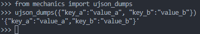

### ujson_dumps
&emsp; This function converts a subset of convertible Python objects into a json string
<!--more-->
###### Code
```python
def ujson_dumps(d, pretty_print=False):
    if type(d) == dict:
        m = clean_dtf_from_dict_for_json_dumping(d)
        if pretty_print: ujson.dumps(m, indent=4)
        return ujson.dumps(m)
    else:
        if pretty_print: return ujson.dumps(d, indent=4)
        else: return ujson.dumps(d)
```
###### Example
